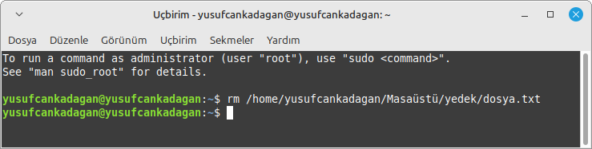
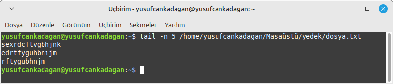

# Başlık

## `ls` Komutu
Dizin içeriğini listeler.

```bash
ls 
```


## `pwd` Komutu


```bash
pwd
```


## `mkdir` Komutu
Yeni bir dizin oluşturur.
```bash
mkdir 
```


## `rmdir` Komutu

Boş dizinleri siler.
```bash
rmdir 
```


## `touch` Komutu

Yeni, boş bir dosya oluşturur veya bir dosyanın son değiştirilme zamanını
```bash
touch 
```


## `cp` Komutu

Dosya veya dizinleri kopyalar.
```bash
cp
```


## `mv` Komutu
Bir dosyayı veya dizini taşımak veya yeniden adlandırmak için kullanılan komuttur.

```bash
mv
```


## `rm` Komutu
Bir dosya veya dizini silmek için kullanılan komuttur. Dizinleri silmek için -r (recursive) seçeneği kullanılır. Örneğin, rm dosya.txt komutu, dosya.txt dosyasını silerken, rm -r dizin_adı komutu, belirtilen dizini ve içeriğini siler. Silinen dosyalar geri alınamaz, bu yüzden dikkatli kullanılmalıdır.

```bash
rm
```


## `find` Komutu
Belirli bir dizinde veya tüm dosya sisteminde, verilen kriterlere göre dosya veya dizin aramak için kullanılır.

```bash
find
```


## `locate` Komutu
Sistemdeki dosyaları hızlı bir şekilde bulmak için kullanılan bir komuttur. Dosya adını veya dosya yolunu içeren kelimeleri arar ve bulunduğu yerleri listeler. locate komutu, veritabanı kullanarak çok hızlı sonuçlar verir, ancak veritabanının güncel olması gerekir. Güncellemek için updatedb komutu kullanılır.

```bash
locate
```


## `tree` Komutu
 Bir dizinin ve alt dizinlerinin hiyerarşik yapısını görsel olarak ağaç şeklinde gösterir. Bu komut, dosya ve klasör yapısını daha anlaşılır bir biçimde sunar. Örneğin, tree komutu, mevcut dizindeki tüm dosyaları ve alt dizinleri ağaç şeklinde listeleyecektir.

```bash
tree
```


## `cat` Komutu
Bir dosyanın içeriğini terminalde görüntülemek için kullanılan komuttur. Ayrıca, birden fazla dosyayı birleştirip tek bir dosya olarak çıktı alabilir veya yeni dosyalar oluşturabilirsiniz. Örneğin, cat dosya.txt komutu, dosyanın içeriğini ekrana yazdırır.

```bash
cat
```


## `less` Komutu
Büyük dosyaları sayfa sayfa görüntülemek için kullanılan bir komuttur. Dosya içeriğini yukarı ve aşağı kaydırarak incelemenizi sağlar. less ile dosya içinde arama yapabilir ve kolayca gezinebilirsiniz.

```bash
less
```


## `head` Komutu
Bir dosyanın veya veri akışının ilk birkaç satırını gösterir. Varsayılan olarak ilk 10 satırı görüntüler, ancak -n seçeneğiyle bu sayıyı değiştirebilirsiniz. Örneğin, head -n 5 dosya.txt komutu, dosyanın ilk 5 satırını gösterir.

```bash
head
```


## `tail` Komutu
Bir dosyanın son birkaç satırını görüntülemek için kullanılan komuttur. Varsayılan olarak son 10 satırı gösterir, ancak -n seçeneğiyle bu sayı değiştirilebilir. Örneğin, tail -n 20 dosya.txt komutu, dosyanın son 20 satırını gösterir. Ayrıca, -f seçeneği ile dosya sürekli olarak izlenebilir, yani dosyaya yeni satırlar eklendikçe anında gösterilir.

```bash
tail
```


## `nano` Komutu
nano: Terminal tabanlı basit bir metin düzenleyicisidir. Dosya oluşturmak ve düzenlemek için kullanılır. Kullanımı kolaydır ve temel metin düzenleme işlevlerine sahiptir, genellikle başlangıç seviyesindeki kullanıcılar için tercih edilir.
```bash
nano
```


## `vim` Komutu
Güçlü bir metin düzenleyicisidir. Terminal üzerinden dosya düzenlemek, yazmak ve düzenlemeler yapmak için kullanılır. Vim, vi editor'ünün geliştirilmiş bir versiyonudur ve birçok ileri düzey özelliğe sahiptir.

```bash
vim
```


## `sort` Komutu
Bir dosya veya veri akışındaki satırları belirli bir düzene (alfabetik, sayısal vb.) göre sıralar. -n seçeneği sayısal sıralama yaparken, -r seçeneği ters sıralama sağlar.

```bash
sort
```


## `uniq` Komutu
Bir dosyada veya veri akışında tekrarlayan ardışık satırları kaldırır ve yalnızca benzersiz satırları gösterir. Genellikle, sort komutuyla birlikte kullanılarak sıralama sonrası tekrarlar temizlenir.

```bash
uniq
```


## `wc` Komutu
Bir dosyanın veya girişin satır, kelime ve karakter sayısını gösterir. Örneğin, -l seçeneği ile satır sayısını, -w ile kelime sayısını, -c ile karakter sayısını görüntüler.

```bash
wc
```


## `df` Komutu
Sistemdeki dosya sistemlerinin disk kullanımını gösterir. Boş alan, kullanılan alan ve toplam kapasiteyi listeler. -h seçeneği ile okunabilir bir biçimde (MB, GB vb.) gösterir.

```bash
df
```


## `du` Komutu
Bir dosya veya dizinin disk kullanımını gösterir. Alt dizinlerle birlikte toplam boyutu hesaplamak için -s veya daha ayrıntılı listeleme için -h seçeneği kullanılabilir.

```bash
du
```


## `free` Komutu
Sistemin RAM ve swap bellek kullanımını gösterir, toplam, kullanılan, boş ve değiştirilebilir bellek miktarlarını listeler.

```bash
free
```


## `uptime` Komutu
Sistemin ne kadar süredir çalıştığını, yük ortalamasını (son 1, 5 ve 15 dakika) ve sistemin saatini gösterir.

```bash
uptime
```


## `unname` Komutu
Sistemin çekirdek bilgilerini, işletim sistemi türünü, sürümünü ve donanım özelliklerini görüntüler. Örneğin, -r ile çekirdek sürümünü, -a ile tüm sistemi gösterir.

```bash
unname
```


## `hostname` Komutu
Sistemin adını (host adı) görüntüler veya değiştirir. Bu, ağ üzerindeki makineleri tanımlamak için kullanılır.

```bash
hostname
```


## `top` Komutu
 Sistemdeki aktif süreçleri, kaynak kullanımını (CPU, bellek vb.) gerçek zamanlı olarak gösteren bir araçtır. Ayrıca, süreçleri sıralamak ve yönetmek için etkileşimli bir arayüz sunar.

```bash
top
```


## `htop` Komutu
Daha kullanıcı dostu bir süreç yöneticisidir. Sistem kaynaklarının (CPU, bellek, vb.) kullanımını gerçek zamanlı olarak gösterir ve süreçleri yönetmeyi kolaylaştırır.

```bash
htop
```


## `ps` Komutu
Sistem üzerinde çalışan süreçleri listeleyen bir komuttur. Mevcut kullanıcıya ait aktif işlemleri gösterir.

```bash
ps
```


## `kill` Komutu
Çalışan bir süreci sonlandırmak için kullanılır. Genellikle, süreç kimliği (PID) ile birlikte kullanılır.

```bash
kill
```


## `ping` Komutu
Belirtilen bir ağ adresine ICMP (Internet Control Message Protocol) paketi göndererek, hedefin erişilebilirliğini ve ağ gecikmesini test eder.

```bash
ping
```


## `curl` Komutu
 URL üzerinden veri almak veya göndermek için kullanılan bir komuttur. Web sayfalarını indirir, API'lere istek gönderir ve dosya transferi yapar.
```bash
curl
```


## `date` Komutu
Sistemin mevcut tarih ve saatini gösterir. Ayrıca, belirli bir formatta tarih ve saat göstermek için kullanılabilir.

```bash
date
```


## `diff` Komutu
İki dosya arasındaki farkları karşılaştırır ve satır bazında ne gibi değişiklikler olduğunu gösterir.

```bash
diff
```


## `dirname` Komutu
 Bir dosya yolunun dizin kısmını döndürür; dosya adını ve yolun geri kalanını ayırır.

```bash
dirname
```


## `id` Komutu
Geçerli kullanıcı veya belirtilen bir kullanıcı için kullanıcı kimliği (UID), grup kimliği (GID) ve grup üyelik bilgilerini gösterir.

```bash
id
```


## `nano` Komutu
Terminalde kullanılan basit bir metin düzenleyicisidir; dosya oluşturmak, düzenlemek veya görüntülemek için kullanılır.


```bash
nano
```


## `stat` Komutu
Bir dosya veya dizin hakkında ayrıntılı bilgileri (boyut, izinler, son erişim/oluşturulma tarihleri vb.) gösterir.

```bash
stat
```


## `users` Komutu
Sisteme şu anda oturum açmış tüm kullanıcıları listeler.


```bash
users
```


## `whoami` Komutu
whoami komutu, Linux veya Unix tabanlı sistemlerde hangi kullanıcı hesabıyla oturum açıldığını gösterir. Bu komut, oturum açmış kullanıcının kullanıcı adını ekrana yazdırır.


```bash
whoami
```


